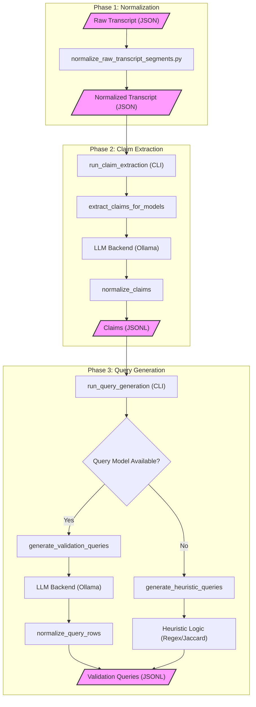

# Health Claims Pipeline (Current)

This document describes the current claims pipeline implemented in the package CLI and source modules.

## Scope

The pipeline supports three workflows:

1. Claim extraction from normalized transcript segments.
2. Validation query generation from extracted claims.
3. End-to-end execution of both stages.

Primary CLI: `uv run proof-please ...`

## Architecture

The implementation is split into three layers:

1. CLI and command wiring
- `src/proof_please/cli.py`
- Owns command options, user-facing messages, and conversion of runtime errors into Typer CLI errors.

2. Pipeline orchestration and stage logic
- `src/proof_please/pipeline/pipeline_runner.py`
- `src/proof_please/pipeline/extract_claims.py`
- `src/proof_please/pipeline/generate_queries.py`
- `src/proof_please/pipeline/normalize.py`
- `src/proof_please/pipeline/dedupe.py`
- `src/proof_please/pipeline/chunking.py`
- `src/proof_please/pipeline/models.py`

3. Core adapters/shared APIs
- `src/proof_please/core/model_client.py`
- `src/proof_please/core/io.py`
- `src/proof_please/core/printing.py`

The pipeline layer is intentionally framework-agnostic (no direct Typer/Rich dependency).

## Model Backend

The model client is backend-oriented rather than Ollama-specific.

- Runtime config model: `ModelBackendConfig` in `src/proof_please/pipeline/models.py`
- Backend client: `src/proof_please/core/model_client.py`
- Model listing: `list_available_models(...)`
- Chat call: `chat_with_model(...)`

Endpoint strategy:

1. OpenAI-compatible endpoints first (`/v1/models`, `/v1/chat/completions`)
2. Legacy Ollama endpoints fallback (`/api/tags`, `/api/chat`)

CLI options:

- `--backend-url` (primary)
- `--ollama-url` (backward-compatible alias)

## Commands

Inspect all commands:

```bash
uv run proof-please --help
```

Stage-specific help:

```bash
uv run proof-please extract-claims --help
uv run proof-please generate-queries --help
uv run proof-please run-pipeline --help
```

## Data Flow

The pipeline transforms unstructured raw transcript data into structured health claims, then generates specific scientific validation queries.



### 1. Normalization

Converts raw, unsegmented transcript JSON into a structured format ready for processing.
- **Source**: `data/transcripts/raw/` (typically the output of whisper or similar transcribers).
- **Logic**: [`scripts/normalize_raw_transcript_segments.py`](file:///Users/diogoneves/Projects/proof-please/scripts/normalize_raw_transcript_segments.py).
- **Action**: Parses speaker transitions and timestamps to create a list of `segments` with speaker IDs and start times.

### 2. extract-claims

Extracts health claims from the normalized transcript using LLM models.
1. Load normalized transcript JSON (`doc_id`, `segments`).
2. Split transcript into overlapping segment chunks via `build_chunks`.
3. Call model backend for strict JSON claim extraction.
4. Normalize rows, coerce types, and apply fallbacks in `normalize_claims`.
5. Deduplicate and assign deterministic `claim_id` values.
6. Write `data/claims.jsonl` (or custom output).

### 3. generate-queries

Generates scientific validation queries for the extracted claims.
1. Load claims JSONL.
2. Split claims into overlapping chunks.
3. Call model backend for validation query generation.
4. Normalize rows and deduplicate by query text.
5. Add heuristic fallback queries for uncovered claims via `generate_heuristic_queries`.
6. Write `data/claim_queries.jsonl` (or custom output).

## run-pipeline

Runs the two stages in sequence in one command.

## Output Schemas

Claim rows include:

- `claim_id`
- `doc_id`
- `speaker`
- `claim_text`
- `evidence`
- `time_range_s`
- `claim_type`
- `boldness_rating`
- `model`

Validation query rows include:

- `claim_id`
- `query`
- `why_this_query`
- `preferred_sources`

## Design Notes

- Current implementation is prototype-oriented and recall-first.
- Prompt-based extraction/generation remains probabilistic.
- Transcript ingestion/normalization scripts are still prototype utilities and expected to evolve.
